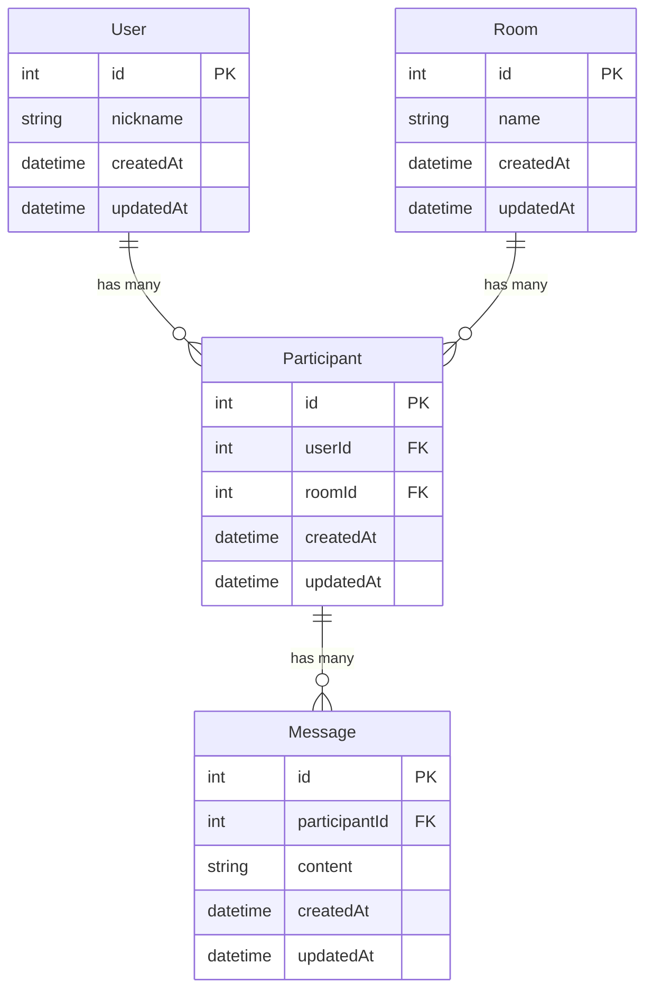

# 실시간 채팅 서비스 설계

## 핵심 아이디어

- 회원가입/로그인 없이 닉네임만 입력해 유저 생성
- 유저(User), 채팅방(Room), 메시지(Message), 참여(Participant) 4개 엔티티로 구성
- 실시간 채팅(WebSocket 등) 지원

## 데이터 모델 및 관계

- **User**: 채팅에 참여하는 사람
- **Room**: 여러 유저가 모여 대화하는 공간
- **Message**: 유저가 방에 남긴 채팅 메시지
- **Participant**: User와 Room의 참여 관계(N:M 연결 테이블, 한 유저가 여러 방에 참여, 한 방에 여러 유저 참여 가능)

### 관계(ERD)

- User 1 : N Participant
- Room 1 : N Participant
- Participant N : M Message

### 설명

- Message는 User와 Room을 각각 참조(FK)
- 이 구조만으로도 실시간 채팅(방별 메시지 송수신, 유저 구분) 구현 가능
- Participant는 User와 Room의 N:M(다대다) 참여 관계를 관리하는 연결 테이블 역할
- 한 유저가 여러 방에 참여할 수 있고, 한 방에 여러 유저가 참여 가능
- Message는 특정 Participant(=방에 참여 중인 유저)가 남긴 메시지로, 누가 어느 방에서 썼는지 명확하게 추적 가능

## Shared Import 규칙

### 목적

- shared 패키지 파일이 늘어나도 apps의 tsconfig를 매번 수정하지 않기
- web(Bundler)와 socket-server(NodeNext)에서 동일한 import 패턴 유지하기

### tsconfig 규칙

- 각 앱 tsconfig에는 아래 1줄만 유지
- paths: "@dvmbr/shared/_" -> "../../packages/shared/src/_.ts"

### import 규칙

- shared 코드는 파일 경로를 그대로 사용
- 예: @dvmbr/shared/socket/socket-events
- 예: @dvmbr/shared/socket/socket-query

### 피해야 할 패턴

- 서브패스마다 tsconfig paths를 개별 추가하는 방식
- NodeNext에서 re-export index를 여러 단계 경유하는 방식

## Socket 타입 문서

- 소켓 타입 운영 가이드: wiki/socket-typing-guide.md
